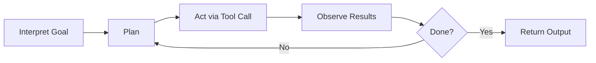

# Agentic AI in Work and Careers
### What It Is, Why It Matters, and What It Means for You

> College Lecture — 10-Minute Module

<!-- NOTES: Welcome students. Frame this as a practical briefing, not a hype session. The goal is that they leave with vocabulary, a mental model, and a realistic view of how this affects their careers. -->

---

## Agenda

1. What is "agentic AI"?
2. The mental model: a loop plus tools
3. Agents vs. chatbots vs. traditional automation
4. Real productivity evidence
5. Where agents show up by domain
6. Risks that don't disappear
7. What this means for your career
8. Your playbook for responsible use

<!-- NOTES: Move briskly — roughly 1 minute per section, with a bit more time on the mental model and career slides. -->

---

## Why "Agentic AI" Matters Right Now

*Part 1 of 8*

The term "agent" is being used to describe everything from chatbots to full automation — so vocabulary matters.

- **AI assistant** — the user stays in the driver's seat
- **AI agent** — the system can *decide and act*, often through tools
- **Agentic workflow** — an LLM wrapped in planning, tool calls, and checkpoints
- **Autonomous system** — higher independence, higher risk

> The key distinction: agents don't just talk — they *do things*.

<!-- NOTES: Ask students: "Have you seen 'agent' used in marketing lately? What did it seem to mean?" Let a few answers land, then anchor the four terms. Stress that autonomy is a spectrum, not a switch. -->

---

## The Mental Model: A Loop Plus Tools

*Part 2 of 8*

Most agents follow a repeating cycle:

**Tools** are what connect the model to the real world — databases, calendars, code execution, CRMs, APIs.

> Most agent failures are *tool failures* (wrong action, wrong permissions), not bad writing.

<!-- NOTES: This is the single most important conceptual slide. Linger here. Point out that "planning" and "tool use" are what separate agents from a plain chatbot. Mention ReAct (reason + act) as the foundational pattern if students want to look it up. -->

---

## How Agents Differ from What Came Before

*Part 3 of 8*

| | Chatbot | Copilot | Agent | Traditional Automation |
|---|---|---|---|---|
| **Primary output** | Text responses | Suggestions & drafts | Actions + drafts | Rule-based execution |
| **Who picks the next step?** | User | User (with hints) | Often the agent | The programmer |
| **Adaptability** | Medium | Medium | Higher, less predictable | Low — brittle |
| **Main risk** | Misleading text | Misleading text | Wrong *actions*, cascading errors | Edge-case failures |

> "Agent" is not a magic word — it shifts *where* complexity and risk show up.

<!-- NOTES: Walk through the table column by column. Emphasize that traditional automation is predictable but breaks easily, while agents are flexible but less predictable. That trade-off is the core governance challenge. -->

---

## Real Evidence: Productivity Gains Are Real but Uneven

*Part 4 of 8*

- **Professional writing** — experiments found faster completion *and* higher rated quality for certain tasks
- **Customer support** — a large field study showed the biggest gains among *less experienced* workers
- **Software development** — controlled studies show productivity improvements, but results vary by setting and measurement

**Why this matters for you:**

AI may **"raise the floor"** — changing how beginners add value and reshaping what internships look like.

<!-- NOTES: This is where students perk up because it's about them. Emphasize that "gains for novices" means the skills that differentiate juniors will shift toward judgment and review, not just raw output speed. Ask: "If AI makes everyone's first draft equally good, what makes YOU stand out?" -->

---

## Where Agents Show Up by Domain

*Part 5 of 8*

- **Finance** — internal copilots for research retrieval, meeting summaries, and guided workflows (not "AI traders"). Governance is a first-class requirement.
- **Business ops** — enterprise platforms are productizing agents inside sales ops, support, HR, procurement, and IT service management.
- **Professional communication** — AI speeds drafting, but the biggest risk is trust, authenticity, and factual accuracy, not grammar.
- **Programming** — the shift from autocomplete to "agents that modify codebases" is fundamentally a *governance* shift. New risks include dependency changes, security regressions, and prompt injection in tool pipelines.

<!-- NOTES: Pick the domain most relevant to the class and spend an extra beat there. For a business class, lean into ops and communication. For CS, lean into programming. For finance, emphasize that "agents" in banking are usually constrained systems, not free-roaming bots. -->

---

## Risks That Don't Disappear

*Part 6 of 8*

**Hallucinations** — fluent output that is factually wrong. RAG (retrieval-augmented generation) *reduces* this but does not eliminate it.

**Prompt injection** — malicious instructions hidden in inputs that trick agents into unsafe actions. Especially dangerous when the agent can use tools.

**Accountability gaps** — regulators (NIST, FINRA, EU AI Act) stress that existing obligations still apply when firms use AI. "Who is responsible?" never goes away.

> Agent evaluation is an active research area — always ask: *"How was this tested?"*

<!-- NOTES: Don't rush this slide. These three risks are the most important things students should internalize. Mention that OWASP now has a Top 10 specifically for LLM applications. The point is not to scare them but to build a habit of asking "what could go wrong?" -->

---

## What This Means for Your Career

*Part 7 of 8*

**Expect task redesign, not instant job disappearance.**

- Task exposure to LLMs is broad across occupations — including higher-wage work
- But exposure is not adoption, and adoption is not displacement
- The dominant pattern so far is **augmentation**: humans shift toward judgment, coordination, and accountability while AI handles more drafting, retrieval, and routine actions

**The skills that will matter most:**

- **AI literacy + domain fundamentals** — knowing failure modes, when to verify, when regulation applies
- **Evaluation habits** — citations, tests, source checking, peer review
- **Security & privacy basics** — permissions, data minimization, prompt injection awareness
- **Process thinking** — mapping workflows and defining approval gates

<!-- NOTES: This is the slide to land on strongly. Students should leave feeling empowered, not threatened. Frame it: "The best thing you can do is learn your domain deeply AND learn to work with these tools critically." -->

---

## Your Playbook: Using Agents Responsibly

*Part 8 of 8*

1. **Start low-stakes** — drafts, outlines, summaries. Graduate to higher stakes only with strong checks.
2. **Keep sensitive data out** unless you have an approved, secure environment.
3. **Trust tool output over model confidence** — prefer workflows where key facts come from retrieved sources or computed results.
4. **Review agent work like you review human work** — in code, run tests; in writing, check facts; in business ops, verify records.
5. **Document your use** — what tool did what, what you verified. Good science *and* good professional practice.

> The safest professional stance: **trust, then verify.**

<!-- NOTES: Frame this as a checklist they can take into internships and first jobs. If time allows, mention that "document your use" is increasingly an expectation in regulated industries. -->

---

## Myths vs. Realities

| Myth | Reality |
|---|---|
| "Agents are basically employees." | Most are constrained copilots; accountability stays with humans. |
| "If it's an agent, it's reliable." | Agent evaluation is an active research area with new failure modes. |
| "RAG eliminates hallucinations." | RAG reduces them — it does not make them disappear. |
| "AI only affects low-skill jobs." | Task exposure is broad, including higher-wage knowledge work. |
| "Using AI always boosts productivity." | Gains are real but uneven — they depend on task, experience, and context. |

<!-- NOTES: If you're short on time, use this as a quick verbal lightning round rather than reading each row. It's also a good handout reference. -->

---

## Discussion Questions

1. When does a tool stop being an "assistant" and become an "agent" in a meaningful way?
2. If AI raises novice performance faster than expert performance, how should that change internships, onboarding, and grading?
3. In a team using agents, what does "accountability" look like when an agent takes a harmful action?
4. Should companies let AI agents send messages or execute transactions automatically — or should humans always click "approve"?
5. What skills should universities prioritize if task exposure to LLMs is broad across occupations?

<!-- NOTES: Pick 1–2 questions depending on remaining time. Questions 2 and 5 tend to generate the most engagement with undergrads. If this is the end of the 10-minute segment, plant one question for students to think about before next class. -->

---

## Key Takeaways

- **Agentic AI = LLM + control loop + tool access** — tool access is where both the value and the risk appear
- **Productivity gains are real** but depend on task, experience, and integration
- **Governance is part of competence** — supervision, logging, and review are professional skills now
- **Your career shift** is best understood as task redesign: more judgment, less routine drafting
- **Trust, then verify** — treat AI output as a draft that must be checked

<!-- NOTES: Summarize quickly. If time remains, open the floor briefly for any quick questions. Otherwise, point students to the full reading and glossary for reference. -->

---

## Questions?

> Thank you — see the full reading for the glossary, sources, and detailed domain breakdowns.

<!-- NOTES: End on time. If students want to dig deeper, point them to NIST AI 600-1, OWASP Top 10 for LLMs, and the ReAct paper as accessible starting points. -->

---
