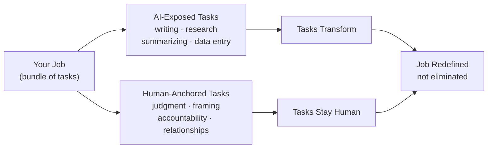
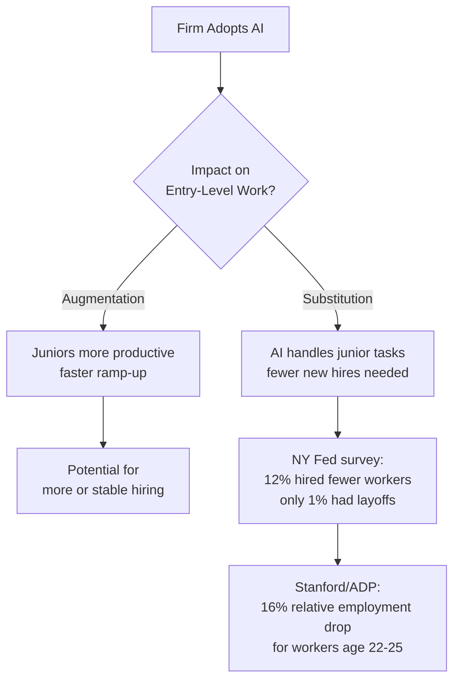

# AI and Entry-Level Jobs
### What the Evidence Actually Says -- and What You Should Do About It

> Jim Weaver -- Spring 2026

---

## Agenda

1. How AI affects work (tasks, not whole jobs)
2. Augmentation: the good news
3. Displacement: the real risk
4. What the data can't tell us yet
5. Your practical strategy

<!-- NOTES: Quick show of hands -- how many of you used an AI tool in the last 24 hours? Use that as the entry point. -->

---

## AI Changes Tasks First, Not Whole Jobs

*Part 1 of 5*

> Most jobs are bundles of tasks. AI hits the "text and screen" tasks first.

- **80%** of U.S. workers could have at least 10% of their tasks affected by LLMs
- **19%** could have at least 50% affected
- Entry-level roles are concentrated in writing, summarizing, searching, basic analysis -- exactly those tasks

**"Exposure" is not the same as "elimination."**

<!-- NOTES: Stress the distinction between exposure and displacement -- students often conflate these. Source: Eloundou et al., "GPTs are GPTs," 2023. -->

---

## The Augmentation Evidence (Good News)

*Part 2 of 5*

### Real companies. Real workers. Real gains.

| Study | Finding |
|---|---|
| Customer support (field) | **+15%** productivity overall; **+30%** for least experienced workers |
| Writing tasks (experiment) | Tasks **40% faster**; quality **+18%** |
| Consulting tasks | **25% faster**, quality **40% higher** on in-scope tasks |
| GitHub Copilot (coding) | Programming tasks completed **55.8% faster** |

> AI is a force multiplier that helps novices the most -- when used correctly.

<!-- NOTES: Emphasize the novice benefit. The call-center data (Brynjolfsson et al.) is the strongest real-world evidence. Spend 30 seconds here. -->

---

## The Displacement Signal (Real Risk)

*Part 3 of 5*

The risk is **not mass layoffs.** It is quieter.

> Firms are not firing juniors. They are simply not hiring as many.

<!-- NOTES: This is the most important single fact for this audience. Pause. Let it land. Then ask: "How does that change your job search strategy?" -->

---

## What the Big Forecasts Really Mean

*Part 4 of 5*

You've seen the scary headlines. Here's the context.

- Goldman Sachs: **300 million** jobs globally exposed to automation -- *this is a scenario, not a measurement*
- IMF: AI could affect **40%** of global employment -- *again, a scenario*
- Budget Lab at Yale: **no detectable economywide disruption yet** in standard labor data

**The pattern so far:**
- Big effects in *specific* micro studies
- Muted signals in *aggregate* macro data

> Forecasts are useful scenarios. They are not predictions of what has already happened.

<!-- NOTES: Students are often anxious about the headlines. This slide is about calibration, not dismissal. The evidence is real but early. -->

---

## Your Practical Strategy

*Part 5 of 5*

**Three things that will make you stand out:**

1. **Demonstrate AI literacy employers can trust**
   - When to use AI, how to verify output, how to protect sensitive data
   - AI literacy in job postings grew *6x* in one year -- but is still rare

2. **Show you can supervise AI, not just use it**
   - Spot hallucinations. Check sources. Apply domain judgment.
   - "Human in the loop" is what firms need most right now

3. **Signal you can ramp quickly**
   - AI accelerates learning curves for novices
   - Show you learn fast -- that directly addresses firms' biggest hesitation about hiring juniors

<!-- NOTES: Concrete and actionable. Tell students to build a portfolio artifact that includes a "verification log" showing they checked AI output. -->

---

## The Bottom Line

> The question is not "Will AI take my job?"
>
> It is "Will I be the person who knows how to use AI responsibly -- or the one who doesn't?"

- Entry-level work is being **redefined**, not eliminated
- Employers will expect higher-quality output, faster, with AI tools
- The skills that AI cannot reliably replace: **problem framing, domain judgment, communication, accountability**

**Get ahead of that expectation before you graduate.**

<!-- NOTES: End on agency, not anxiety. This is the frame you want students to carry out of the room. -->

---

## Key Sources

- Brynjolfsson, Li, Raymond -- "Generative AI at Work" (NBER / QJE 2025)
- Brynjolfsson et al. -- "Canaries in the Coal Mine" (Stanford, Nov 2025)
- Dell'Acqua et al. -- "Navigating the Jagged Technological Frontier" (HBS, 2023)
- Eloundou et al. -- "GPTs are GPTs" (OpenAI / arXiv, 2023)
- Gimbel et al. -- "Labor Market AI Exposure" (Budget Lab at Yale, Feb 2026)
- Abel et al. -- NY Fed employer survey (Sep 2025)
- Bick, Blandin, Deming -- "Rapid Adoption of Generative AI" (NBER, 2025)

---

## Questions?

> What surprised you most?

- Slides and source links: ask after class
- Next session: we'll look at which specific occupations face the highest exposure

<!-- NOTES: Open the floor. If it's quiet, prompt with: "Does the 'fewer hires, not more layoffs' finding change how you think about your job search timeline?" -->
