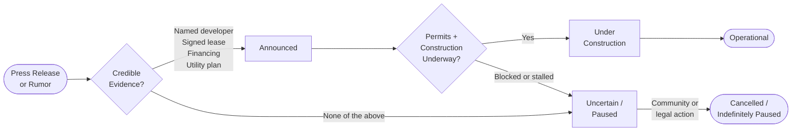
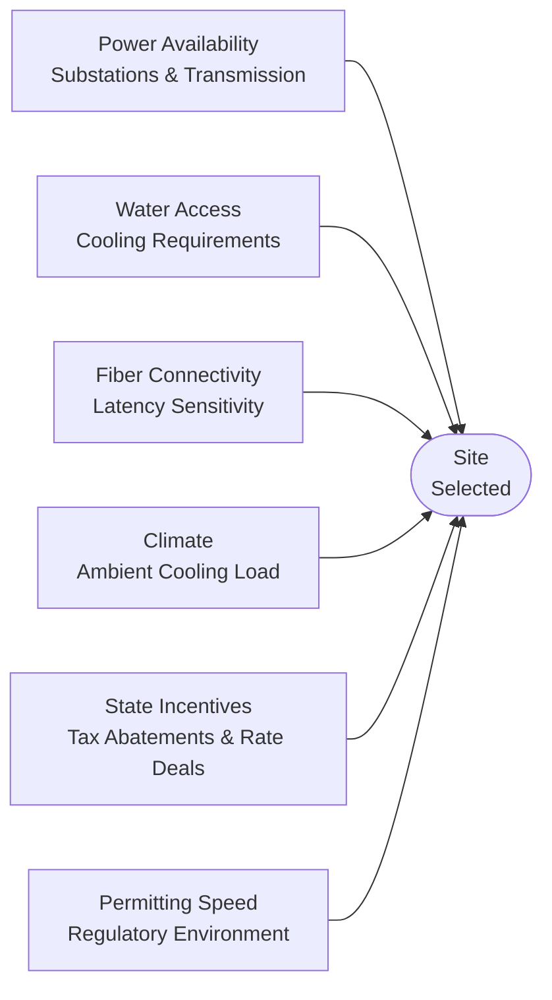

# AI Data Centers in the United States
### Power, Infrastructure, and the Compute Buildout

> Jim Weaver -- Spring 2026

<!-- NOTES: Welcome students. Tell them this 10-minute segment sets up the bigger unit on AI infrastructure policy and energy economics. -->

---

## Agenda

1. What *is* an AI data center?
2. The U.S. landscape today
3. The next wave -- projects in the pipeline
4. Why geography matters
5. Tradeoffs: grid, water, and community
6. Discussion questions

---

## What Makes an "AI Data Center" Different?

*Part 1 of 5*

Not just "more servers" -- a fundamentally different infrastructure type:

- **Accelerator-heavy racks** -- GPUs and TPUs, not general CPUs
- **High power density** -- 10x or more compared to traditional data centers
- **Liquid cooling** -- air cooling can't keep up with rack heat loads
- **"AI factories"** vs. general hyperscale campuses that run some AI on the side

> The constraint is no longer land or capital -- it's **power delivery**.

<!-- NOTES: Ask students: "What do you think the bottleneck is for building these? Land? Money?" Then reveal it's actually getting electricity to the site. -->

---

## Scale Check: How Much Energy Are We Talking?

**176 TWh** consumed by U.S. data centers in 2023

That was roughly **4.4%** of all U.S. electricity.

The DOE projects that share could reach:

| Scenario | Share of U.S. Electricity by 2028 |
|----------|-----------------------------------|
| Low estimate | ~6.7% |
| High estimate | ~12% |

> Uncertainty is enormous -- it depends on how fast AI adoption moves.

<!-- NOTES: For scale: the entire state of California uses about 7-8% of U.S. electricity. This is a big deal. -->

---

## Who's Building Right Now?

*Part 2 of 5*

Five key player types in the U.S. ecosystem:

| Player Type | Examples |
|-------------|----------|
| Hyperscalers | AWS, Microsoft, Google, Meta |
| AI labs | OpenAI (Stargate), xAI (Colossus) |
| GPU cloud providers | CoreWeave, Applied Digital |
| Colocation developers | QTS, STACK, Vantage, Hut 8 |
| Utilities and DOE | DOE's Lux supercomputer at Oak Ridge |

**Operational examples worth knowing:**
- xAI **Colossus** (Memphis, TN) -- GPU supercluster training Grok
- Oracle-OpenAI **Abilene campus** (TX) -- partially live as of early 2025
- **El Capitan** (Lawrence Livermore, CA) -- #1 on TOP500, 1.8 exaFLOPs

<!-- NOTES: Emphasize that "AI data center" covers a huge range -- from national labs to private GPU clouds. -->

---

## The Pipeline: Four Status Categories

*Part 3 of 5*

When evaluating any announced project, use this taxonomy:

1. **Operational** -- generating compute now
2. **Under construction** -- permits granted, shovels in the ground
3. **Announced** -- credibly documented plans (signed lease, utility plan, financing)
4. **Uncertain / paused** -- legal or political friction, or just a press release

> The most credible announcements include at least one of: a named developer, a signed long-term lease, documented financing, or an identified utility plan.

<!-- NOTES: This is a critical thinking framework. Train students to ask "what tier is this claim?" every time they see a headline. -->

---

## How a Project Moves Through the Pipeline

<!-- NOTES: Walk through a real example -- Prince William County Digital Gateway entered as "Announced," got rezoning voided, and dropped to Paused. Lordstown moved from Announced to Under Construction after groundbreaking was reported. -->

---

## Selected Projects in the Pipeline

| Project | Developer | Location | Status | Scale |
|---------|-----------|----------|--------|-------|
| Stargate (5 sites) | OpenAI / Oracle / SoftBank | Multiple states | Mix: under construction + proposed | ~7 GW planned; >$400B |
| Hyperion campus | Meta / Blue Owl JV | Richland Parish, LA | Under construction | >2 GW; $27B financing |
| Meta Lebanon campus | Meta | Lebanon, IN | Under construction | 1 GW; >$10B |
| Milam County site | SB Energy / OpenAI | Milam County, TX | Announced | 1.2 GW |
| Digital Gateway | QTS + Compass | Prince William Co., VA | **Paused / legally blocked** | Up to 37 data centers |

<!-- NOTES: Use the Virginia example to show that community opposition is now a real constraint, not a footnote. Rezoning was voided; construction barred. -->

---

## Why Certain Regions Win

*Part 4 of 5*

Site selection is driven by a cluster of factors:

- **Power availability** -- existing substations, transmission headroom
- **Permitting speed** -- state and local regulatory environment
- **Water access** -- for cooling (highly sensitive locally)
- **Fiber connectivity** -- latency matters for some AI workloads
- **Climate** -- cooler climates reduce mechanical cooling load
- **State incentives** -- tax abatements, utility rate agreements

**Two contrasting models:**
- **Northern Virginia** -- mature hub, path dependence, but increasingly grid-constrained
- **Louisiana / Texas** -- fast-growing hubs with land and power access but new friction emerging

<!-- NOTES: Path dependence is a great econ concept to reinforce here -- NoVA grew because it already had fiber and talent, which attracted more investment, which is now choking the power grid. -->

---

## Site Selection: Six Competing Factors

> No region wins on all six. Every hub involves tradeoffs.

<!-- NOTES: Ask students which factor they think matters most right now. Answer: power availability is currently the binding constraint in most established markets. -->

---

## Tradeoffs: Grid, Water, and Community

*Part 5 of 5*

**Grid impacts** -- system-wide
- Who pays for substation and transmission upgrades?
- Ratepayer vs. developer cost-allocation is a live policy fight

**Water impacts** -- local and project-specific
- Cooling design determines water use intensity (WUE metric)
- Closed-loop systems differ sharply from open evaporative cooling

**Community conflicts** -- no longer an edge case
- Noise (generators, cooling fans)
- Air quality (on-site diesel or gas turbines for backup/primary power)
- Land use and tax base debates

> Electricity impacts are **system-wide**. Water and air impacts are **intensely local**.

<!-- NOTES: xAI Colossus in Memphis faced significant permitting conflict over gas turbines. Use that as a concrete local story. -->

---

## Discussion Questions

Take 2 minutes to think about one of these:

1. Should data center developers be required to fund new generation and transmission? How should that obligation be enforced?

2. Is a gigawatt-scale AI campus closer to "tech infrastructure" or "industrial infrastructure" -- and should permitting treat it differently?

3. What metrics should communities demand before approving a project: PUE, water use, hourly carbon matching, something else?

4. How should policymakers weigh national AI competitiveness arguments against local land-use and ratepayer costs?

5. What level of evidence should be required before granting zoning approvals or tax incentives?

<!-- NOTES: Pick ONE question based on what clicked in the room. These map to the energy policy, land use, and environmental justice threads you'll return to later in the course. -->

---

## Key Takeaways

- AI data centers are defined by **power density and accelerators**, not just server count
- The U.S. buildout is **power-constrained**, not land- or capital-constrained
- Projects range from operational to speculative -- **always check the evidence tier**
- Geography is driven by power, permitting, water, and incentives together
- Environmental and community impacts are real, uneven, and increasingly contested

> Next session: Deep dive into energy grid policy and who pays for the infrastructure buildout.

<!-- NOTES: Leave 1-2 minutes for questions. Point students to the DOE Berkeley Lab study and Reuters/AP reporting on Stargate for reading. -->
