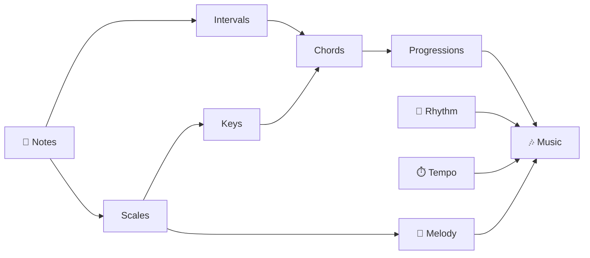

# Basic Music Theory
### A Foundation for Understanding How Music Works

> Jim Weaver -- March 2026

---

## Agenda

1. Sound and Pitch
2. The Musical Alphabet and Notes
3. Rhythm, Beat, and Tempo
4. Scales and Keys
5. Intervals
6. Chords and Harmony
7. Time Signatures
8. Reading Music: The Staff
9. Putting It All Together
10. Q&A

<!-- NOTES: Welcome everyone. This is designed to be accessible to total beginners -- no prior knowledge assumed. -->

---

## Section 1: Sound and Pitch

<!-- *Part 1 of 9* -->

- **Sound** is vibration traveling through air as waves
- **Pitch** describes how high or low a sound is
- Faster vibrations = **higher pitch**
- Slower vibrations = **lower pitch**
- Pitch is measured in **Hertz (Hz)**

> The note A above middle C vibrates at exactly 440 Hz.

<!-- NOTES: You can demonstrate this by humming a low note vs. a high note and asking the audience to feel the difference. -->

---

## Pitch in Practice

| Note | Frequency (Hz) |
|------|---------------|
| A3   | 220 Hz        |
| A4 (concert A) | 440 Hz |
| A5   | 880 Hz        |

- Each octave **doubles** the frequency
- This relationship is what makes music feel mathematical

**Every musical system in the world organizes pitch.**

---

## Section 2: The Musical Alphabet and Notes

<!-- *Part 2 of 9* -->

- Western music uses **7 letter names** for notes:

> **A -- B -- C -- D -- E -- F -- G**

- After G, the pattern **repeats** in a higher octave
- These 7 notes produce the **natural notes** (the white keys on a piano)

<!-- NOTES: Have them say the alphabet out loud. Then point out that music only uses 7 of the 26 letters. -->

---

## Sharps and Flats

- Between most natural notes, there are **in-between pitches**
- A **sharp (#)** raises a note by one **half step**
- A **flat (b)** lowers a note by one **half step**

| Sharp Name | Flat Name | Same Pitch? |
|------------|-----------|-------------|
| C#         | Db        | Yes         |
| F#         | Gb        | Yes         |
| G#         | Ab        | Yes         |

- Notes that share the same pitch are called **enharmonic equivalents**

> *Part 2 of 9*

---

## The 12 Notes

All 12 pitches in Western music (one octave):

```
C  C#/Db  D  D#/Eb  E  F  F#/Gb  G  G#/Ab  A  A#/Bb  B
```

- These 12 notes repeat across **octaves** (higher and lower versions)
- The distance from any note to the same note in the next octave = **1 octave**

---

## Section 3: Rhythm, Beat, and Tempo

<!-- *Part 3 of 9* -->

- **Rhythm** is the pattern of long and short sounds in music
- The **beat** is the steady pulse underneath music
- **Tempo** is how fast or slow the beat moves

> Tempo is measured in **BPM** (beats per minute).

| Tempo Marking | Meaning        | Approx. BPM |
|---------------|----------------|-------------|
| Largo         | Very slow      | 40-60       |
| Andante       | Walking pace   | 76-108      |
| Allegro       | Fast, lively   | 120-156     |
| Presto        | Very fast      | 168-200     |

<!-- NOTES: Clap a slow beat, then a fast beat. Ask the room to clap along. -->

---

## Note Values (Duration)

| Symbol Name    | Beats (in 4/4) | Relative Length |
|----------------|---------------|-----------------|
| Whole note     | 4 beats       | oooo            |
| Half note      | 2 beats       | oo              |
| Quarter note   | 1 beat        | o               |
| Eighth note    | 1/2 beat      | .               |
| Sixteenth note | 1/4 beat      | ,               |

- A **dot** after a note adds **half its value**
- Example: dotted quarter = 1.5 beats

---

## Section 4: Scales and Keys

<!-- *Part 4 of 9* -->

- A **scale** is a sequence of notes arranged by pitch
- The most common scale in Western music: the **Major Scale**
- Built using a specific pattern of **whole steps (W)** and **half steps (H)**

> Major Scale Formula: **W W H W W W H**

### C Major Scale

```
C  D  E  F  G  A  B  C
 W  W  H  W  W  W  H
```

- Sounds "happy" or "bright" to most listeners

<!-- NOTES: Sing or play "Do Re Mi" -- that's a major scale! -->

---

## Minor Scales

- **Natural Minor** scale sounds "darker" or "sadder"
- Formula: **W H W W H W W**

### A Minor Scale (Natural)

```
A  B  C  D  E  F  G  A
 W  H  W  W  H  W  W
```

- A Minor uses the same notes as C Major -- they are **relative keys**
- Every major key has a **relative minor** built on its 6th note

---

## Keys and Key Signatures

- A **key** defines which scale a piece of music is based on
- A **key signature** tells you which notes are sharp or flat throughout
- There are **15 major keys** (including enharmonic equivalents)

| Key      | Sharps/Flats |
|----------|-------------|
| C Major  | None        |
| G Major  | 1 sharp (F#)|
| D Major  | 2 sharps    |
| F Major  | 1 flat (Bb) |
| Bb Major | 2 flats     |

> The **Circle of Fifths** maps all 15 keys and their relationships.

---

## Section 5: Intervals

<!-- *Part 5 of 9* -->

- An **interval** is the distance between two notes
- Intervals are named by the **number of scale steps** between them

| Interval | Half Steps | Example |
|----------|-----------|---------|
| Unison   | 0         | C to C  |
| Major 2nd| 2         | C to D  |
| Major 3rd| 4         | C to E  |
| Perfect 4th | 5      | C to F  |
| Perfect 5th | 7      | C to G  |
| Major 6th| 9         | C to A  |
| Octave   | 12        | C to C  |

<!-- NOTES: Intervals are how melodies move. Ear training is all about recognizing these by sound. -->

---

## Consonance vs. Dissonance

- **Consonant** intervals sound stable and resolved
  - Perfect 5th, octave, major 3rd
- **Dissonant** intervals sound tense and unstable
  - Minor 2nd, tritone (augmented 4th)

> Tension and release -- the push and pull of dissonance to consonance -- is the engine of music.

---

## Section 6: Chords and Harmony

<!-- *Part 6 of 9* -->

- A **chord** is three or more notes played simultaneously
- The simplest chord: a **triad** (3 notes)
- Triads are built by stacking **thirds** on top of a root note

### Major Triad (C Major)

```
Root  +  Major 3rd  +  Perfect 5th
 C    +      E      +      G
```

### Minor Triad (A Minor)

```
Root  +  Minor 3rd  +  Perfect 5th
 A    +      C      +      E
```

---

## The Four Triad Types

| Type        | Formula             | Sound        |
|-------------|---------------------|--------------|
| Major       | Root + M3 + P5      | Bright, happy|
| Minor       | Root + m3 + P5      | Dark, sad    |
| Augmented   | Root + M3 + A5      | Tense, eerie |
| Diminished  | Root + m3 + d5      | Unstable     |

> Most popular music is built entirely from major and minor chords.

---

## Chord Progressions

- A **chord progression** is a sequence of chords
- Chords in a key are numbered with **Roman numerals**
- In C Major: I=C, ii=Dm, iii=Em, IV=F, V=G, vi=Am, vii°=Bdim

**The most common progressions in pop music:**

- `I -- IV -- V -- I` (the foundation of blues and rock)
- `I -- V -- vi -- IV` (used in hundreds of hit songs)
- `ii -- V -- I` (the backbone of jazz)

<!-- NOTES: Play or sing "Let It Be" -- I V vi IV. The audience will recognize it. -->

---

## Section 7: Time Signatures

<!-- *Part 7 of 9* -->

- A **time signature** tells you how many beats are in each measure
- Written as a fraction at the start of a piece

```
4       <- top number: beats per measure
-
4       <- bottom number: which note gets one beat
```

| Time Signature | Beats/Measure | Feel              |
|----------------|--------------|-------------------|
| 4/4            | 4            | March, pop, rock  |
| 3/4            | 3            | Waltz             |
| 6/8            | 6 (felt as 2)| Compound, flowing |
| 5/4            | 5            | Asymmetric, odd   |

> 4/4 is so common it's called **common time**.

---

## Measures and Bar Lines

- Music is divided into equal units called **measures** (or bars)
- **Bar lines** separate measures on the staff
- A **double bar line** marks the end of a section
- A **final bar line** marks the end of a piece

```
| measure 1 | measure 2 | measure 3 ||
```

---

## Section 8: Reading Music -- The Staff

<!-- *Part 8 of 9* -->

- Music is written on a **staff**: 5 horizontal lines
- Notes sit **on** lines or **between** lines (in spaces)
- Higher on the staff = **higher pitch**

### The Treble Clef (G Clef)

Lines (bottom to top): **E G B D F**
> *"Every Good Boy Does Fine"*

Spaces (bottom to top): **F A C E**
> *"FACE in the space"*

<!-- NOTES: Have them write this down. These mnemonics are how musicians memorize note positions. -->

---

## The Bass Clef (F Clef)

- Used for lower-pitched instruments (bass guitar, cello, left hand piano)

Lines (bottom to top): **G B D F A**
> *"Good Boys Do Fine Always"*

Spaces (bottom to top): **A C E G**
> *"All Cows Eat Grass"*

---

## Ledger Lines and Middle C

- Notes that go above or below the staff use **ledger lines**
- **Middle C** sits on a ledger line just below the treble staff
- The same Middle C sits on a ledger line just above the bass staff

```
Treble: ------- (space above)
        ------- (top line)
            ...
        _  (ledger line = Middle C)

Bass:   _  (ledger line = Middle C)
        ------- (bottom line)
```

---

## Section 9: Putting It All Together

<!-- *Part 9 of 9* -->

- A piece of music combines ALL of these elements simultaneously:

| Element      | Answers the Question |
|--------------|---------------------|
| Pitch/Notes  | *What* is played?   |
| Rhythm       | *When* is it played?|
| Dynamics     | *How loud?*         |
| Tempo        | *How fast?*         |
| Key/Scale    | *What flavor?*      |
| Chords       | *What harmony?*     |
| Time Sig.    | *What pulse?*       |

> A composer balances all of these at once to create emotion and meaning.

---

## How the Elements Connect



---

## The Learning Path Forward

From here, great next steps include:

1. **Ear training** -- recognizing intervals and chords by ear
2. **Sight reading** -- playing written music on an instrument
3. **Harmony** -- understanding how chords function and move
4. **Form** -- verse, chorus, bridge; sonata form; 12-bar blues
5. **Counterpoint** -- writing independent melodic lines that work together
6. **Genre study** -- how theory applies differently in jazz, classical, pop

> Pick an instrument and practice daily. Theory makes the most sense when it's connected to playing.

<!-- NOTES: Encourage them to just start. No one learns theory in isolation -- it needs to be applied. -->

---

## Key Takeaways

- **12 notes** form the basis of all Western music
- **Scales** give music its "flavor" (major = bright, minor = dark)
- **Intervals** describe distance between notes
- **Chords** are stacked intervals played together
- **Rhythm** and **time signatures** organize music in time
- **The staff** is the visual language music is written in

> Music theory is not a rulebook -- it's a map. The music comes from *you*.

---

## Thank You

- These slides: save as `basic-music-theory.md`
- Recommended resource: *The Complete Musician* by Steven Laitz
- Online tools: musictheory.net, teoria.com, eartrainer.com

> Questions?

<!-- NOTES: Leave plenty of time for questions. Common ones: "Do I need to read music to play?" and "Which instrument should I start with?" -->
