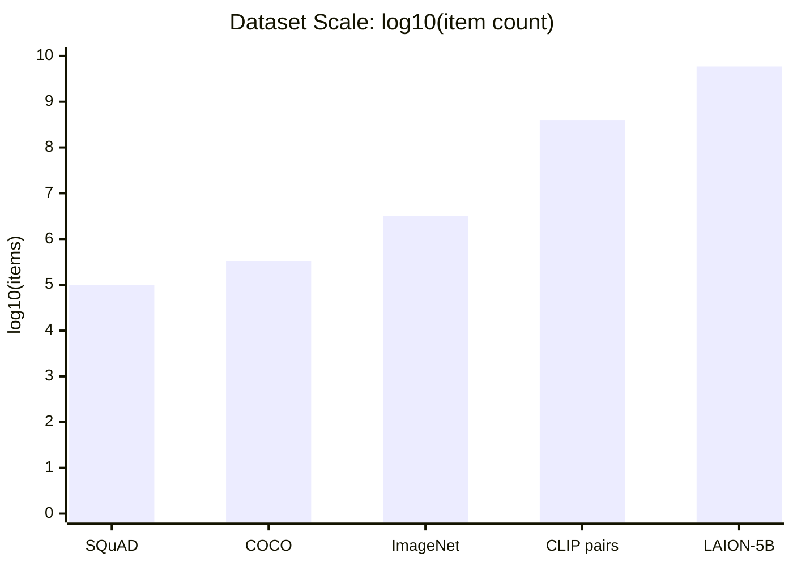
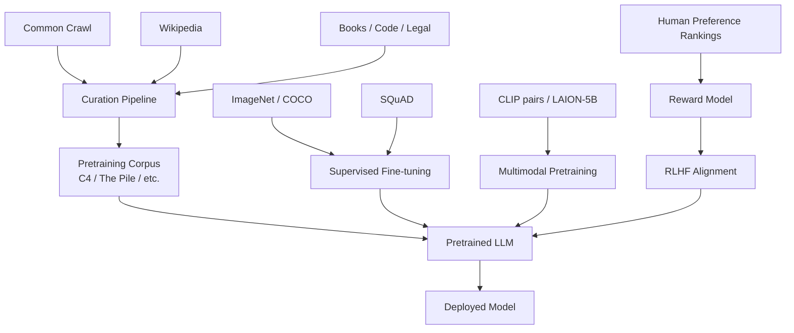

# How Modern AI Is Trained
### A Focus on Training Data

> Jim Weaver -- Spring 2026

---

## Agenda

1. Why data is the foundation, not an afterthought
2. Web crawl corpora: Common Crawl, C4, The Pile
3. Labeled vision datasets: ImageNet and COCO
4. Labeled language datasets: SQuAD
5. Multimodal datasets: CLIP pairs and LAION-5B
6. Preference and alignment data
7. Proprietary and synthetic data
8. How data flows into a model
9. Curation: what happens before training even starts
10. Risks rooted in data choices

<!-- NOTES: Tell students upfront: "The architecture gets all the press, but the data is usually where the real capability -- and the real problems -- come from." -->

---

## *Part 1 of 10*
## Data Is Not a Detail

- Popular coverage focuses on **model architecture** (Transformers, attention, layers)
- But the same architecture trained on different data produces a **fundamentally different model**
- Every capability, every bias, every failure mode traces back to:
  - **What was included** in training data
  - **What was excluded**
  - **How it was cleaned and filtered**
  - **Who labeled it** -- and by what guidelines

> "The model is a compressed reflection of its training data. Fix the data, fix the model."

<!-- NOTES: This is the core thesis of the whole segment. Come back to it at the end. -->

---

## *Part 2 of 10*
## Common Crawl: The Raw Web at Scale

- A **nonprofit** that has been crawling the public web since 2008
- Publishes petabyte-scale snapshots monthly, free to download
- Each crawl snapshot contains **billions of web pages** in WARC, WAT, and WET formats
- The single most used upstream source in large language model training

### What it looks like in practice

- Raw HTML pages from across the internet -- product listings, blogs, news, forums, spam, hate speech, legal text, recipes, code, and everything else
- No filtering at the crawl stage -- Common Crawl captures the web as it is
- **Used directly or as an upstream source by:** GPT-3, T5/C4, The Pile, LLaMA, and most other large LLMs

> Common Crawl is the "raw ore." Almost every major LLM was built on top of it.

<!-- NOTES: Ask students: what does "the web as it is" actually mean for model quality and safety? -->

---

## *Part 3 of 10*
## C4: Colossal Clean Crawled Corpus

- Created by Google as part of the **T5** (Text-to-Text Transfer Transformer) project (2020)
- Starts from a snapshot of Common Crawl and applies aggressive filtering

### C4 filtering pipeline

1. Keep only lines ending in terminal punctuation
2. Remove pages with fewer than 5 sentences
3. Deduplicate 3-sentence spans
4. Remove pages containing profanity (word list filter)
5. Remove "Lorem ipsum" placeholder text and code-heavy pages
6. Keep only text identified as English

### The result

- Starting snapshot: ~1 trillion tokens of raw web text
- After filtering: **~156 billion tokens** -- roughly 750 GB of cleaned text
- Used to pretrain T5; widely reused as a standard text pretraining corpus

### The tradeoff

- Filtering for "clean" English inadvertently **underrepresents dialects, non-standard writing, and non-English speakers who write partly in English**
- Later audit work found C4 contains medical and legal text, some personal data, and sources that users did not expect to be included

<!-- NOTES: Good discussion point: whose definition of "clean" was used? This is not a neutral decision. -->

---

## *Part 4 of 10*
## The Pile: A Diverse Multi-Source Corpus

- Created by **EleutherAI** (2021) to train GPT-NeoX and GPT-J
- Designed explicitly to be **diverse across domains** rather than just large
- Total size: **~825 GB** of text across 22 named components

### The Pile's components (selected)

| Component | Source | Approx. size |
|---|---|---|
| Pile-CC | Common Crawl filtered subset | ~227 GB |
| PubMed Central | Scientific biomedical papers | ~90 GB |
| Books3 | Copyrighted books (scraped) | ~100 GB |
| GitHub | Public code repositories | ~95 GB |
| Wikipedia (en) | English Wikipedia | ~6 GB |
| FreeLaw | US court opinions | ~51 GB |
| OpenWebText2 | Reddit-linked articles | ~62 GB |
| ArXiv | Scientific preprints | ~56 GB |
| DM Mathematics | Synthetic math problems | ~21 GB |

### Why diversity matters

- A model trained only on web text underperforms on **scientific reasoning, legal analysis, and code** compared to one trained on The Pile
- Domain mixture is a design choice -- and it shapes downstream capability **directly**

> Books3 scraped copyrighted books without permission and became the center of major copyright litigation against AI companies.

<!-- NOTES: The Books3 story is worth a moment. It illustrates that "technically downloadable" and "legally usable for training" are very different things. -->

---

## *Part 5 of 10*
## ImageNet: The Dataset That Launched Deep Learning

- Created by **Fei-Fei Li and colleagues** at Stanford (2009 paper; ILSVRC competition from 2010)
- **~14 million images** hand-labeled with ~22,000 categories from the WordNet ontology
- The **ILSVRC** benchmark subset: ~1.2 million images across 1,000 categories

### How it was built

- Images sourced from internet image searches
- Labels verified by **Amazon Mechanical Turk** crowd workers
- Multiple workers per image to improve label reliability

### Why it mattered

- In 2012, AlexNet won ILSVRC with a **15.3% top-5 error rate** -- vs. the previous best of 26.2%
- This single result triggered the modern deep learning era
- Proved that **data + compute + depth** beats hand-crafted features

### COCO: Common Objects in Context

- Microsoft Research (2014); **~330,000 images**
- Each image annotated with: bounding boxes (80 categories), instance segmentation masks, and **5 human-written captions**
- The captions make COCO a bridge between vision and language -- used to train and evaluate **multimodal models**

<!-- NOTES: The ImageNet story is genuinely dramatic. One dataset and one competition result reset an entire field overnight. -->

---

## *Part 6 of 10*
## SQuAD: Stanford Question Answering Dataset

- Created by Stanford NLP (2016, v1.1; v2.0 in 2018)
- **~100,000 question-answer pairs** written by **crowd workers** over ~500 Wikipedia articles
- Task: given a passage and a question, identify the **span of text** in the passage that answers it

### SQuAD v2.0: the unanswerable question twist

- Added ~50,000 questions whose answer is **not in the passage**
- Models must decide: "Is there an answer here at all?"
- Far harder and more realistic than v1.1

### Why SQuAD shaped NLP

- Defined the standard format for **extractive question answering**
- Used to evaluate BERT (2018), which achieved near-human performance and validated the pretraining approach
- Demonstrated that pretraining on unlabeled text + fine-tuning on a small labeled dataset could match models trained on far more labeled data

### Limitations

- Wikipedia-only: formal, encyclopedic writing does not represent most real-world text
- Workers wrote questions **after reading the passage** -- real users don't behave this way
- English-only

<!-- NOTES: SQuAD is a good case study in how benchmark design shapes what we think "intelligence" means. Near-human on SQuAD does not mean near-human reasoning. -->

---

## *Part 7 of 10*
## CLIP and LAION-5B: Multimodal at Scale

### CLIP (Contrastive Language-Image Pretraining) -- OpenAI, 2021

- Trained on **~400 million (image, text) pairs** collected from the public internet
- The text is whatever alt-text, caption, or surrounding text appeared near the image online
- Trained with a **contrastive objective**: pull matching image-text pairs together, push non-matching pairs apart
- Enables **zero-shot image classification**: describe a category in text, classify images without retraining

### LAION-5B -- LAION, 2022

- Open reproduction and massive extension of the CLIP training data approach
- **5.85 billion** image-text pairs filtered using CLIP similarity scores
- Three subsets: LAION-en (English), LAION-multi (100+ languages), LAION-aesthetics (high aesthetic score)
- Used to train **Stable Diffusion** and other open image generation models

### The scale comparison

> The gap between SQuAD (100K items) and LAION-5B (5.85B items) is roughly **58,000x**.
> LAION-5B was later found to contain CSAM and was taken offline for re-filtering -- a concrete governance failure at scale.

<!-- NOTES: Pause on the LAION CSAM incident. This is not a hypothetical risk. It happened. -->

---

## *Part 8 of 10*
## Preference Data and Alignment Datasets

### Why alignment data is different

- Pretraining teaches the model **to predict text**
- It does not teach the model **to be helpful, honest, or safe**
- That requires a separate phase: **Reinforcement Learning from Human Feedback (RLHF)**

### What RLHF data looks like (InstructGPT / ChatGPT approach)

**Step 1 -- Demonstration data**
- Human contractors write high-quality example responses to prompts
- InstructGPT used a team of ~40 contractors
- Size: tens of thousands of examples -- tiny by pretraining standards

**Step 2 -- Comparison data**
- The model generates several responses to a prompt
- Human raters **rank** those responses from best to worst
- InstructGPT collected ~33,000 comparisons
- A **reward model** is trained to predict human preference scores

**Step 3 -- RL optimization**
- The LLM is optimized using PPO to maximize the learned reward
- The reward model acts as a proxy for human judgment at scale

> A model trained on human preferences behaves very differently from one trained only on next-token prediction -- even with an identical architecture.

<!-- NOTES: This is why ChatGPT felt so different from raw GPT-3. Same architecture family. Completely different behavior because of the alignment data. -->

---

## *Part 9 of 10*
## Proprietary and Synthetic Data

### Proprietary corpora

- Many frontier models train on data that is **never publicly disclosed**
- May include: licensed books, news archives, internal documents, user interaction logs
- Legal and competitive reasons limit transparency
- Creates a **reproducibility gap**: researchers cannot replicate results without the same data

### Synthetic data

- **Model-generated** examples: prompts, answers, code, math problems
- Alpaca (Stanford, 2023) used GPT-3 outputs to instruction-tune a smaller model cheaply
- Risk: if the teacher model has biases, the student model **inherits and amplifies** them
- Risk: feedback loops -- a model trained on its own outputs drifts from reality

### How data flows from sources to model

<!-- NOTES: Walk through each arrow. Every arrow represents a deliberate human decision. -->

---

## *Part 10 of 10*
## Curation and Data Risks

### What curation actually involves

| Step | What it does | Hidden cost |
|---|---|---|
| Language filtering | Keeps target language(s) | Reduces linguistic diversity |
| Quality scoring | Raises average text quality | Encodes whose "quality" counts |
| Deduplication | Cuts memorization and privacy leakage | Expensive at petabyte scale |
| Toxicity filtering | Removes harmful content patterns | Word lists miss context; over-blocks dialects |
| Domain exclusions | Blocks specific sites or categories | Requires human judgment calls |
| Licensing review | Checks reuse rights | Often incomplete; legally risky |

### Where data-rooted harms show up

- **Privacy:** LLMs can reproduce verbatim training text including personal data; larger models are more vulnerable to extraction
- **Bias:** Overrepresentation of English, Western, majority-demographic sources shapes model worldview
- **Copyright:** "Publicly accessible" is not "licensed for training" -- Books3 and LAION are both examples of this tension in practice
- **Safety:** LAION-5B contained CSAM; the dataset had to be pulled and re-released

> Every curation decision is a **values decision** -- not just a technical one.

<!-- NOTES: End here with weight. Ask: "Who made these decisions? Were they the right people? Were they accountable?" -->

---

## Questions?

- Slides and sources: see course LMS
- Key papers: T5/C4 (1910.10683), The Pile (2101.00027), CLIP (2103.00020), LAION-5B (2210.08402), InstructGPT (2203.02155), Datasheets for Datasets (1803.09010), ImageNet (image-net.org/static_files/papers/imagenet_cvpr09.pdf), SQuAD (1606.05250)
- Next session: Model architecture -- what the Transformer actually does with all this data

> *"The architecture gets the credit. The data does the work."*
