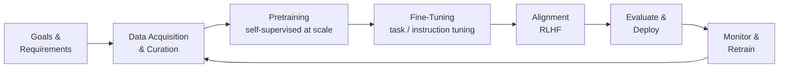
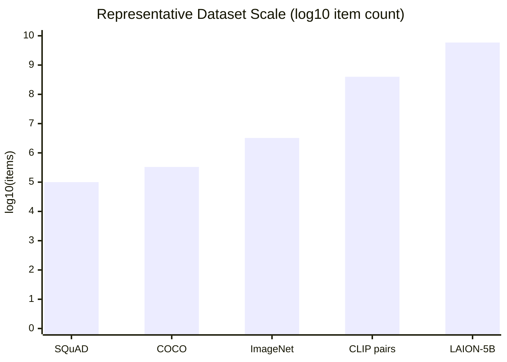
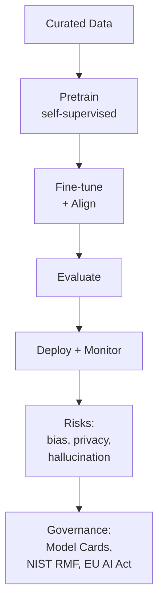

# How Modern AI Is Trained
### A 10-Minute Overview

> Jim Weaver -- Spring 2026

---

## Agenda

1. The Big Picture: What "training" actually means
2. Learning Paradigms: Four ways machines learn
3. The Training Lifecycle: From raw data to deployed model
4. Data: The fuel that drives everything
5. Risks and Governance

<!-- NOTES: 10-minute segment. Move briskly -- aim ~2 min per major section. Tell students this is a map, not a deep dive. -->

---

## *Part 1 of 5*
## What Does "Training" Actually Mean?

- A model learns by **adjusting its parameters** to minimize a loss function
- Training is not a single step -- it is a **multi-phase pipeline**
- Modern AI systems go through: data curation, pretraining, fine-tuning, alignment, evaluation, and monitoring

> "Frontier AI training is rarely a single algorithm run once."

<!-- NOTES: Anchor students here. Many think training = feeding data to a neural net once. Correct this early. -->

---

## *Part 2 of 5*
## Four Ways Machines Learn

| Paradigm | What Guides Learning | Example |
|---|---|---|
| **Supervised** | Human-labeled input-output pairs | ImageNet, SQuAD |
| **Self-supervised** | Labels hidden inside the data itself | BERT, GPT-3 |
| **Reinforcement (RL)** | A scalar reward signal | AlphaZero |
| **RLHF** | Human preference rankings + learned reward | InstructGPT (ChatGPT-style) |

> Self-supervised learning is why modern LLMs can train on trillions of tokens -- **no human labeler required.**

<!-- NOTES: Pause on RLHF. Students are often surprised that ChatGPT-style behavior is shaped by human preference rankings, not just text prediction. -->

---

## *Part 3 of 5*
## The Training Lifecycle

- **Pretraining** = broad capabilities from massive data
- **Fine-tuning** = adapts the model to a specific task or style
- **Alignment** = shapes behavior to match human values and intent
- The loop never fully closes -- models are **continuously monitored**

<!-- NOTES: Walk through the diagram left to right. Stress the feedback loop at the end -- this is often invisible in popular coverage. -->

---

## *Part 4 of 5*
## Data: The Fuel That Drives Everything

### Where does training data come from?

- **Web crawls** -- Common Crawl: petabytes of raw text from the public web
- **Curated corpora** -- C4, The Pile: filtered and cleaned versions
- **Labeled datasets** -- ImageNet (images), SQuAD (Q&A), COCO (object detection)
- **Image-text pairs** -- CLIP (400M pairs), LAION-5B (billions of pairs)
- **Synthetic data** -- model-generated examples; useful but risky

### Why curation is not optional

- Raw web data is **noisy, biased, and duplicated**
- Deduplication reduces memorization and privacy leakage
- Filtering shapes what the model believes is "normal"

> The data you train on determines the model's worldview -- not just its accuracy.

<!-- NOTES: Ask students: "What happens if 80% of the training data is in English?" Good prompt for bias discussion. -->

---

## Dataset Scale: Why Self-Supervision Won

- Labeled datasets top out around **millions** of examples
- Self-supervised corpora reach **billions to trillions**
- This scale gap explains why pretraining on unlabeled data became dominant

<!-- NOTES: This chart is log scale -- stress that. The gap between SQuAD and LAION-5B is not 2x, it's roughly 50,000x. -->

---

## *Part 5 of 5*
## Risks and Governance

### What can go wrong?

- **Privacy leakage** -- LLMs can reproduce verbatim training sequences including personal data
- **Hallucination** -- models generate confident, plausible-sounding falsehoods
- **Bias** -- models inherit and amplify skews baked into training data
- **Environmental cost** -- large training runs consume significant energy and water

### How the field is responding

- **Datasheets for Datasets** and **Model Cards** -- documentation standards for transparency
- **NIST AI RMF** -- a governance framework for managing AI risk
- **EU AI Act** -- requires lifecycle obligations and training-data transparency for general-purpose AI

> Improving capability without improving governance creates new categories of harm.

<!-- NOTES: Don't linger here -- a full lecture on each risk exists. The goal is to plant the flag: capability and safety must advance together. -->

---

## Putting It All Together

**The one-sentence summary:**
> Modern AI training is a continuous, multi-phase pipeline where data quality, alignment, and governance are just as important as the model architecture.

<!-- NOTES: Use this as your closing frame. Encourage students to ask: "What data was this trained on?" whenever they use an AI tool. -->

---

## Questions?

- Slides and sources: see course LMS
- Key papers: BERT, GPT-3, InstructGPT, Datasheets for Datasets, NIST AI RMF 1.0
- Next session: Deep dive into Transformers and attention mechanisms

> *"The model is only as good as the pipeline that produced it."*
